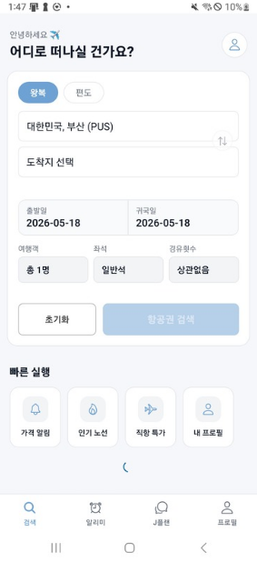
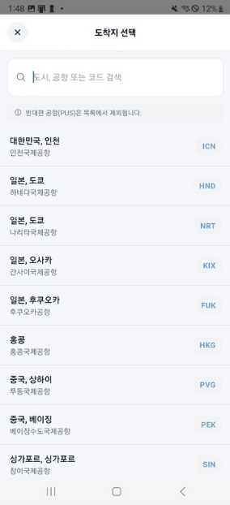
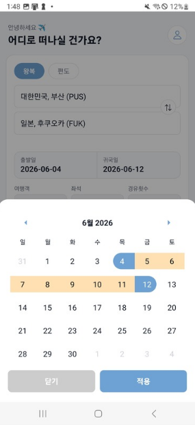
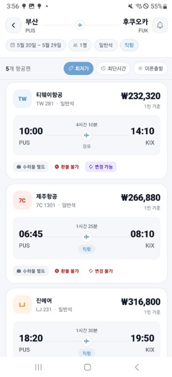
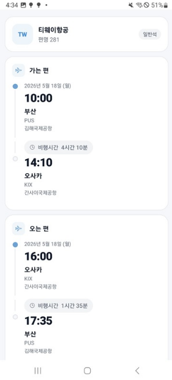
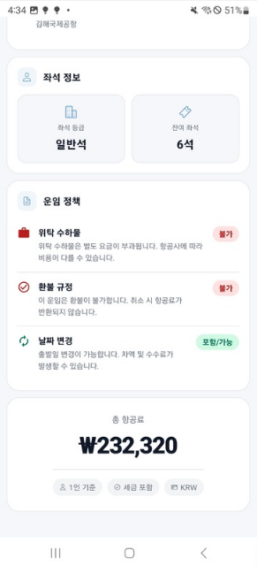
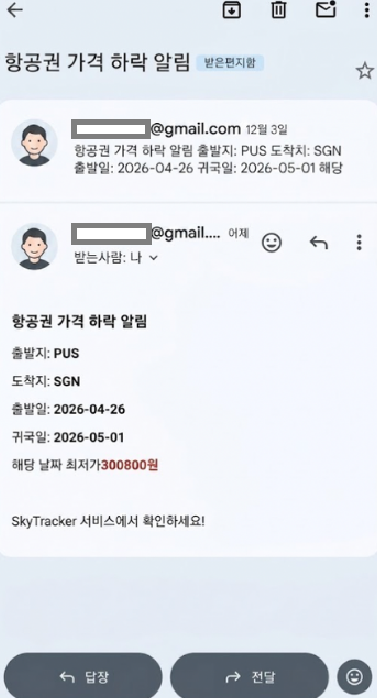

# SkyTracker

**항공편 검색부터 가격 알림·여행 계획까지 한 앱에서 이어지는 서비스입니다.**  
Expo(React Native)와 TypeScript 기반의 단일 코드베이스로 개발했으며, 웹과 Android 실기기에서 동작을 확인했습니다.

| 항목 | 내용 |
|------|------|
| **웹 배포** | [https://didwldnd.github.io/skytracker/](https://didwldnd.github.io/skytracker/) |
| **저장소** | [https://github.com/didwldnd/skytracker](https://github.com/didwldnd/skytracker) |

> 백엔드가 연동하던 [Amadeus Self-Service](https://developers.amadeus.com/) 서비스 종료로 현재 항공편 조회 등 관련 기능이 제한됩니다. 아래 캡처는 API 연동이 가능했던 시점의 화면입니다.

---

## 개발 배경 및 담당 역할

모바일 앱 개발을 경험하기 위해 시작한 첫 팀 프로젝트입니다. 기초 강의를 수강한 뒤 실제 서비스를 구현하며 학습하고자 했으며, 팀원들과 검색·인증·알림 등 다양한 연동을 경험할 수 있는 항공권 서비스를 선정했습니다.

KAYAK의 탐색 흐름과 UI를 참고해 시작하고, 프로젝트 요구사항에 맞춰 화면과 기능을 보완했습니다.

| 항목 | 내용 |
|------|------|
| 개발 기간 | 2025.07 ~ 2025.10 |
| 팀 구성 | 프론트엔드 1명(본인), 백엔드 2명 |
| 담당 역할 | 프론트엔드 화면·상태 관리·API 연동·웹 배포 |
| 실행 확인 | 웹 및 Android 실기기(갤럭시 노트) |

프론트엔드에서 담당한 범위는 다음과 같습니다.

- 항공편 검색 조건 입력, 결과 목록·상세 화면 구현
- 백엔드 응답을 화면에서 사용하는 데이터 구조로 변환
- 가격 알림 등록·조회·변경 기능 연동
- 소셜 로그인 이후 앱 복귀와 토큰 처리 연동
- J플랜 채팅 화면과 대화 기록 연동
- 테마·사용자 설정 관리 및 웹 배포

백엔드 팀은 외부 항공편 API 연동, 가격 확인·이메일 발송, 인증 및 J플랜 답변 생성 등을 담당했습니다. 프론트엔드에서는 자체 백엔드 API를 연결하고 응답을 사용자 화면에 반영했습니다. 항공편 검색은 `/api/flights/search`를 호출하며, 외부 항공편 API는 백엔드가 연동합니다.

---

## 기술 스택

| 구분 | 사용 기술 |
|------|------------|
| 프레임워크 | Expo 54, React Native 0.81 |
| 언어 | TypeScript 5.9 |
| 네비게이션 | React Navigation (Native Stack, Bottom Tabs) |
| UI | React Native Paper, Bottom Sheet, Lottie |
| 상태·컨텍스트 | 인증, 테마, 사용자 설정, 가격 알림 등 도메인별 Context |
| 네트워크 | Axios, 자체 백엔드 API 연동 |
| 기타 | Reanimated, Gesture Handler, Secure Store, OAuth |

---

## 주요 화면

> 라이트·다크 테마를 지원하며, 아래 캡처에는 두 테마의 화면이 포함되어 있습니다.

### 항공편 검색

출발·도착 공항과 여행 날짜, 인원·좌석 조건을 설정해 항공편을 검색합니다.

| 검색 조건 | 공항 선택 | 날짜 선택 |
|:---:|:---:|:---:|
|  |  |  |

### 검색 결과 및 상세

항공편의 가격과 출도착 시간을 비교하고, 상세 화면에서 왕복 일정·좌석 정보·운임 정책을 확인합니다.

검색 결과와 상세 화면은 서로 다른 조회 예시입니다.

| 검색 결과 | 왕복 일정 | 좌석·운임 정책 |
|:---:|:---:|:---:|
|  |  |  |

### 가격 알림

등록한 항공편 조건의 가격 하락을 이메일로 안내하는 기능의 수신 예시입니다.

| 가격 알림 이메일 |
|:---:|
|  |

### J플랜

채팅으로 여행지와 여행 시기, 항공권 관련 정보를 질문하고 답변을 확인할 수 있습니다.

| J플랜 채팅 |
|:---:|
|  |

---

## 구현 과정과 배운 점

### 항공편 응답을 화면 목적에 맞게 변환

항공편 데이터는 편도·왕복 여부에 따라 포함된 구간과 시간이 달랐고, 목록에서 비슷하게 보이는 항목도 단순한 중복으로 판단하기 어려웠습니다.

백엔드의 `legs`를 가는 편·오는 편으로 해석해 편도·왕복을 동일한 화면용 구조로 변환하는 함수를 분리했습니다. 구간별 출도착 시간과 duration을 나누고, 전체 여정 가격과 예약 가능 좌석 수(여러 구간 중 최소값)를 매핑해 검색·알림에서 공통 상세 화면으로 이어지도록 정리했습니다. 검색 응답은 배열이나 `{data}`, `{results}` 같은 컨테이너 형태를 배열로 정규화한 뒤 사용합니다.

현재 결과 목록은 항공사·편명·공항·가는 편/오는 편 출도착 시간을 조합해 동일 여정을 식별하고, 같은 여정이 중복되면 더 낮은 가격의 항목을 유지합니다. 이를 통해 API 응답을 그대로 나열하는 것과 사용자가 비교하기 좋은 목록을 구성하는 것은 다른 문제라는 점을 배웠습니다.

### 요청·응답 로그를 통한 백엔드 협업

초기에는 메신저로 API 경로와 요청 형식을 공유했습니다. 전달 과정의 오타나 서로 다른 이해 때문에 연동이 실패해도 원인을 찾는 데 시간이 걸렸습니다. 소셜 로그인 이후 앱 복귀와 토큰 처리도 프론트엔드와 백엔드의 흐름을 함께 확인해야 했습니다.

요청 주소·전송 값·응답과 서버 로그를 대조하며 문제가 발생한 구간을 좁혔습니다. 화면 코드만 수정하기보다 실제 요청과 응답을 팀원과 함께 확인하는 방식이 원인 파악에 도움이 됐습니다.

이 경험을 통해 개발 전에 API 계약과 인증 흐름을 명확히 합의하고, 변경 사항을 문서로 공유해야 한다는 점을 배웠습니다. 이후 DDIP에서는 Swagger/OpenAPI 기반으로 응답 타입과 명세를 맞추는 방식을 적용했습니다.

---

## 전체 기능

<details>
<summary>검색·항공편, 가격 알림, J플랜, 프로필·계정</summary>

### 검색·항공편

- **왕복 / 편도** 선택
- **출발·도착 공항** 선택, 공항 검색 모달(로컬 공항 데이터 기반)
- **가는 날 / 오는 날** 달력 선택
- **탑승 인원**(성인 등) 선택
- **좌석 등급**(일반석 등)·**경유**(직항만 등) 조건
- **인기·핫 노선** 섹션에서 노선 탐색 후 검색 조건으로 이어가기
- **직항 특가** 등 퀵 액션으로 자주 쓰는 흐름 바로가기
- 항공편 **검색 요청·로딩 UI** 후 결과 화면으로 이동
- 검색 결과 **목록** 및 항공편 **상세** 화면
- 항공사·편명·공항·출도착 시간을 조합한 기준으로 동일 여정을 식별하고, 중복 시 더 낮은 가격의 항목을 유지
- **도시별 항공편** 화면(인기 도시 → 해당 도시 관련 항공편 흐름)

### 알리미(가격 알림)

- 항공편 **검색 결과**에서 조건에 맞는 **가격 알림 등록**(백엔드 POST)
- 서버에 등록된 **알림 목록** 조회
- 알림 **켜기/끄기**, **삭제**
- (로그인 사용자 기준) 백엔드 API와 연동

### J플랜

- **채팅형** 여행 일정·정보 안내(출발/도착/날짜/경유/인원 등 입력 가이드)
- 로그인 시 **대화 히스토리** 불러오기·이어서 질문

### 프로필·계정

- **Google / Kakao / Naver** 소셜 로그인(백엔드 OAuth + 앱 커스텀 스킴 리디렉션)
- **액세스·리프레시 토큰** `SecureStore` 저장, 인증이 필요한 요청에서 401 시 access token 갱신 후 재시도
- **프로필 조회·수정**, **로그아웃**, **회원 탈퇴**
- **라이트 / 다크 / 시스템** 테마 전환, OS 다크모드 연동·설정 **영속화**(`AsyncStorage`)
- 앱·알림 등 **사용자 설정** 관리

### 앱 공통

- **스플래시** 화면 후 메인 진입
- 하단 탭: **검색 · 알리미 · J플랜 · 프로필**
- Expo 단일 코드베이스, 웹은 **GitHub Pages**로 배포. 동작은 웹과 Android 실기기에서 확인

</details>

---

## 실행 방법

**요구 사항**: Node.js 18 이상, npm 또는 yarn

```bash
git clone https://github.com/didwldnd/skytracker.git
cd skytracker
npm install
npx expo start --web    # 웹
npm run android         # Android 네이티브 빌드
# iOS는 macOS에서: npm run ios
```

동작 확인은 웹과 Android에서 진행했으며, iOS 명령은 macOS 로컬 실행용입니다.

위 명령으로 프론트엔드를 실행할 수 있지만, 항공편 검색은 자체 백엔드(`/api/flights/search`)를 거치며 백엔드가 연동하던 Amadeus Self-Service가 종료되어 관련 기능은 기존 설정만으로 정상 동작하지 않습니다.

웹 정적 배포:

```bash
npm run build:web
npm run deploy
```

---

## 코드 구조

```
skytracker/
├── App.tsx              # 진입점, 네비게이션·프로바이더
├── HomeScreen.tsx       # 하단 탭
├── components/          # 공통 UI (검색 모달, 카드 등)
├── context/             # Auth, Theme, UserSettings, PriceAlert
├── screens/             # 검색·결과·알림·J플랜·프로필·로그인
├── utils/               # API, OAuth, mapBackendFlight 등
└── types/               # 타입·DTO
```
